# Request execution flow (end-to-end)

Full path from an inbound HTTP request to the HTTP response, covering
session-pool acquisition and the two structurally different runtime
branches: SAS (reuses a parked long-lived process) vs JS/PY/R (spawns a
fresh interpreter process per request).

```mermaid
flowchart TD
    A["HTTP request<br/>POST /SASjsApi/code/execute<br/>or /SASjsApi/stp/execute"] --> B["Controller<br/>code.ts / stp.ts<br/>try/catch wrapper"]
    B --> C["ExecutionController.executeProgram<br/>or .executeFile<br/>Execution.ts:40-77"]
    C --> D{"session already provided?<br/>(e.g. file-upload flow)"}
    D -- no --> E["getSessionController(runTime).getSession()<br/>Session.ts:59-69"]
    D -- yes --> F["use provided session"]
    E --> G{"pending session<br/>available in pool?"}
    G -- yes --> H["reuse it"]
    G -- no --> I["createSession()<br/>SAS: spawns a real sas process, see<br/>sas-execution-handshake.md<br/>JS/PY/R: cheap - folder + id only"]
    H --> J["pre-warm: if pool has fewer<br/>than 3 pending, fire off more<br/>createSession() calls (not awaited)<br/>Session.ts:66"]
    I --> J
    F --> K
    J --> K["session.state = running<br/>Execution.ts:78"]
    K --> L["write webout.txt (empty),<br/>reqHeaders.txt<br/>Execution.ts:85-89"]
    L --> M["processProgram(...)<br/>Execution.ts:96-107"]

    M --> N{"runTime?"}

    N -- SAS --> O["createSASProgram():<br/>wrap user code with _webout<br/>filename, macro vars, autoexec"]
    O --> P["write code.sas via .bkp + rename<br/>processProgram.ts:48-49"]
    P --> Q["poll: while state !== completed<br/>AND state !== failed<br/>processProgram.ts:58-63"]
    Q --> R["processProgram() resolves either way -<br/>state was set by the session's own<br/>process exit handler in Session.ts,<br/>see sas-execution-handshake.md"]

    N -- "JS / PY / R" --> T["createJSProgram / createPythonProgram /<br/>createRProgram: wrap user code similarly"]
    T --> U["write code file; spawn interpreter<br/>fresh via execFile; pipe stdout/stderr<br/>into a log.log write stream<br/>processProgram.ts:117-124"]
    U -- "exit 0" --> Uc["session.state = completed<br/>processProgram.ts:126"]
    U -- "exit non-zero" --> Uf["session.state = failed<br/>session.failureReason = err.toString()<br/>processProgram.ts:131-133"]
    Uc --> R
    Uf --> R

    R --> V["read log.log, webout.txt,<br/>stpsrv_header.txt<br/>Execution.ts:109-113, 121-125"]
    V --> W["guard: if state !== failed,<br/>set state = completed<br/>(don't overwrite a failed session)<br/>Execution.ts:127-137"]
    W --> X["build httpHeaders + result;<br/>embed log in result if<br/>isDebugOn(vars) or<br/>session.failureReason is set<br/>Execution.ts:139-164"]
    X --> Y["Controller: res.send(result)<br/>HTTP 200<br/>(log embedded if the session failed -<br/>same shape as a successful run)"]
```

## Notes

- **Session pool is per-runtime.** SAS sessions and JS/PY/R sessions live in
  separate controllers/pools (`process.sasSessionController` vs
  `process.sessionController`, `Session.ts:239-253`) - a pending SAS session
  is never handed out for a JS request or vice versa.
- **The SAS branch and the JS/PY/R branch converge** on the same
  success/failure signal shape: `session.state` becomes `completed` or
  `failed` either way, and both paths flow through the same log/webout
  reading logic in `Execution.ts` afterward. The mechanics of *how* that
  state gets set differ substantially (see `session-lifecycle.md`).
- **A failed session never throws.** `processProgram()` resolves normally
  whether the session completed or failed - a failed session (e.g. SAS
  `%abort;`, or a non-zero JS/PY/R exit) is a normal outcome of running
  arbitrary user code, not a request-shape/server problem. There is no
  separate error path: the same `Execution.ts:139-164` logic that embeds
  the log for a debug-mode successful run also embeds it when
  `session.failureReason` is set, and the controller always responds 200.
- **`includePrintOutput`** (SAS only) additionally appends `output.lst`
  content to the result when debug mode is on - omitted above for brevity;
  see `Execution.ts:149-156`.
- **`triggerProgram`/`triggerCode`** (fire-and-forget variants, not shown)
  call the same `ExecutionController` methods without awaiting them and
  immediately return `{ sessionId }`; the client polls
  `GET /SASjsApi/session/{sessionId}/state` separately.
