# Request execution flow (end-to-end)

Full path from an inbound HTTP request to the HTTP response, covering
session-pool acquisition and the two structurally different runtime
branches: SAS (reuses a parked long-lived process) vs JS/PY/R (spawns a
fresh interpreter process per request).

```mermaid
flowchart TD
    A["HTTP request<br/>POST /SASjsApi/code/execute<br/>or /SASjsApi/stp/execute"] --> B["Controller<br/>code.ts / stp.ts<br/>try/catch wrapper"]
    B --> C["ExecutionController.executeProgram<br/>or .executeFile<br/>Execution.ts:58-91"]
    C --> D{"session already provided?<br/>(e.g. file-upload flow)"}
    D -- no --> E["getSessionController(runTime).getSession()<br/>Session.ts:59-69"]
    D -- yes --> F["use provided session"]
    E --> G{"pending session<br/>available in pool?"}
    G -- yes --> H["reuse it"]
    G -- no --> I["createSession()<br/>SAS: spawns a real sas process, see<br/>sas-execution-handshake.md<br/>JS/PY/R: cheap - folder + id only"]
    H --> J["pre-warm: if pool has fewer<br/>than 3 pending, fire off more<br/>createSession() calls (not awaited)<br/>Session.ts:66"]
    I --> J
    F --> K
    J --> K["session.state = running<br/>Execution.ts:96"]
    K --> L["write webout.txt (empty),<br/>reqHeaders.txt<br/>Execution.ts:103-107"]
    L --> M["processProgram(...)<br/>processProgram.ts:16-27"]

    M --> N{"runTime?"}

    N -- SAS --> O["createSASProgram():<br/>wrap user code with _webout<br/>filename, macro vars, autoexec"]
    O --> P["write code.sas via .bkp + rename<br/>processProgram.ts:48-49"]
    P --> Q["poll: while session.state !== completed<br/>processProgram.ts:52-58"]
    Q -- "state becomes completed" --> R["resolve"]
    Q -- "state becomes failed" --> S["throw Error(session.failureReason)"]

    N -- "JS / PY / R" --> T["createJSProgram / createPythonProgram /<br/>createRProgram: wrap user code similarly"]
    T --> U["write code file; spawn interpreter<br/>fresh via execFile; pipe stdout/stderr<br/>into a log.log write stream<br/>processProgram.ts:108-134"]
    U -- "exit 0" --> R
    U -- "exit non-zero" --> S

    R --> V["read log.log, webout.txt,<br/>stpsrv_header.txt<br/>Execution.ts:128-131"]
    V --> W["build httpHeaders + result<br/>return ExecuteReturnRaw<br/>Execution.ts:128-151"]
    W --> X["Controller: res.send(result)<br/>HTTP 200"]

    S --> Y["catch in Execution.ts:109-126:<br/>read whatever log exists,<br/>throw SessionExecutionError(message, log)"]
    Y --> Z["Controller catch block<br/>rethrow { code: 400, status: 'failure',<br/>message, error, log }"]
    Z --> AA["res.status(err.code).send(err)<br/>HTTP 400 with complete log"]
```

## Notes

- **Session pool is per-runtime.** SAS sessions and JS/PY/R sessions live in
  separate controllers/pools (`process.sasSessionController` vs
  `process.sessionController`, `Session.ts:239-253`) - a pending SAS session
  is never handed out for a JS request or vice versa.
- **The SAS branch and the JS/PY/R branch converge** on the same
  success/failure signal shape: `session.state` becomes `completed` or
  `failed` either way, and both paths flow through the same log/webout
  reading logic in `Execution.ts` afterward. The mechanics of *how* that
  state gets set differ substantially (see `session-lifecycle.md`).
- **`includePrintOutput`** (SAS only) additionally appends `output.lst`
  content to the result when debug mode is on - omitted above for brevity;
  see `Execution.ts:135-142`.
- **`triggerProgram`/`triggerCode`** (fire-and-forget variants, not shown)
  call the same `ExecutionController` methods without awaiting them and
  immediately return `{ sessionId }`; the client polls
  `GET /SASjsApi/session/{sessionId}/state` separately.
