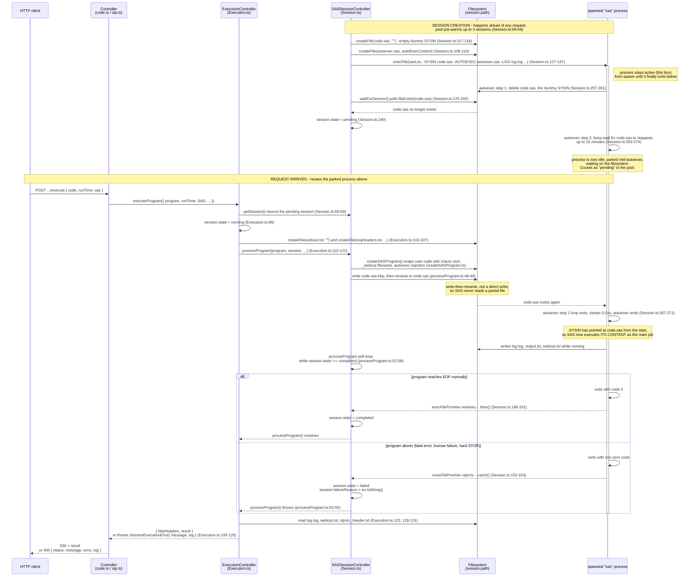

# SAS session execution handshake

How one long-lived `sas` process is turned into a single-use execution slot
via a SYSIN file-swap trick. This is the mechanism specific to
`RunTimeType.SAS`; JS/PY/R sessions spawn a fresh interpreter process per
request instead (see `request-execution-flow.md`).

## Why this design

- SAS has meaningful startup cost (loading the engine, running system init
  macros). Spawning a fresh `sas` process per request would pay that cost
  every time. Instead, a process is spawned once and parked, ready to run
  exactly one job the moment code shows up at a path it's already watching.
- The pool (`SessionController.getSession`, `Session.ts:59-69`) keeps up to
  3 such parked processes ready, so most requests get an instant handoff
  instead of waiting through the ~15-minute autoexec spin-wait or a cold
  start.
- A session is single-use: once its process consumes the real SYSIN content
  and exits (success or failure), that process is gone. The session object
  itself is deleted later by `scheduleSessionDestroy` (`Session.ts:204-236`),
  not reused for a second job.
