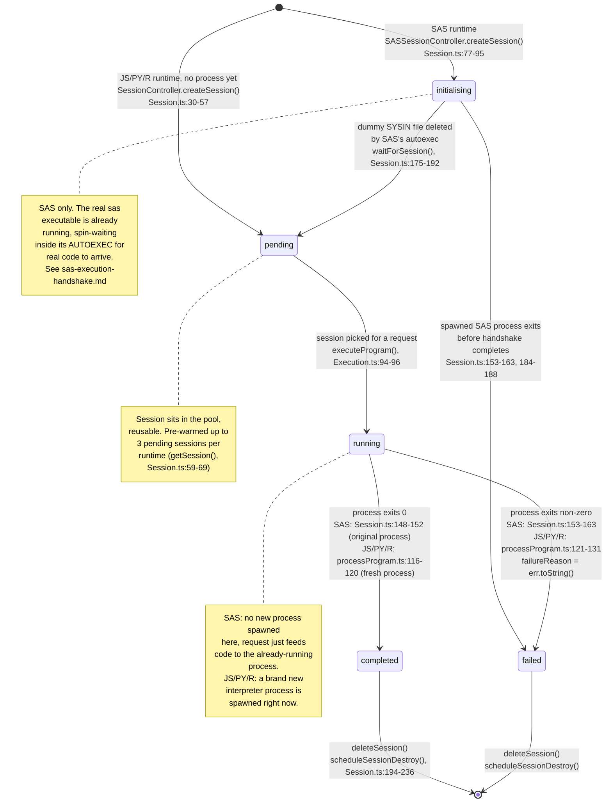

# Session lifecycle (`SessionState`)

Enum defined in `api/src/types/Session.ts`. A `Session` is `{ id, state,
path, creationTimeStamp, deathTimeStamp, expiresAfterMins?, failureReason? }`.
Sessions live in an in-memory array on a per-runtime singleton controller
(`process.sasSessionController` for SAS, `process.sessionController` shared
by JS/PY/R — see `getSessionController()` in `Session.ts:239-253`).

## Consumers of `state`

| Reader | Location | Watches for |
|---|---|---|
| `waitForSession` | `Session.ts:175-192` | `failed` (breaks early) or the dummy SYSIN file disappearing (implies session survived init) |
| `processProgram` (SAS branch poll loop) | `processProgram.ts:52-58` | `completed` (success exit) or `failed` (throws, carrying `session.failureReason`) |
| `scheduleSessionDestroy` | `Session.ts:204-236` | `running` (extends death timer instead of destroying) |

## Asymmetry between runtimes

- **SAS**: one OS process per session, spawned once at `createSession()`
  time and reused for exactly one job (see `sas-execution-handshake.md`).
  `running`/`completed`/`failed` are all driven by that *same* process's
  eventual exit.
- **JS/PY/R**: a session is cheap (folder + id, no process). The interpreter
  process is spawned fresh, per request, inside `processProgram.ts:115` and
  its exit drives `completed`/`failed` directly in the same function - there
  is no separate poll loop for these runtimes.
