# Authentication flow

How a client (browser SPA or CLI/SDK) turns a username/password into an
authenticated `SASjsApi` request, and how that request is subsequently
authorized. The mechanism is a self-hosted session-then-authorization-code
flow, optionally backed by LDAP for credential verification.

```mermaid
sequenceDiagram
    participant Browser as Client<br/>(browser SPA, or CLI/SDK<br/>simulating one with a cookie jar)
    participant Web as Web routes + controller<br/>(routes/web/web.ts,<br/>controllers/web.ts)
    participant Mid as authenticateAccessToken<br/>(middlewares/authenticateToken.ts)
    participant Authz as authorize<br/>(middlewares/authorize.ts)
    participant AuthCtrl as Auth routes + controller<br/>(routes/api/auth.ts,<br/>controllers/auth.ts)
    participant Sess as Session store<br/>(MongoDB via connect-mongo)
    participant DB as MongoDB<br/>(User / Client / Permission)
    participant LDAP as LDAP server<br/>(optional, AUTH_PROVIDERS=ldap)
    participant API as Any SASjsApi route

    Note over Browser,Web: STEP 0 - load the app, get a CSRF token
    Browser->>Web: GET /
    Web-->>Browser: index.html with an inline script that sets<br/>document.cookie = XSRF-TOKEN=...<br/>(routes/web/web.ts:14-32, csrfProtection.ts:7)

    Note over Browser,LDAP: STEP 1 - username/password login, establishes a session
    Browser->>Web: POST /SASLogon/login { username, password }
    Web->>Web: desktopRestrict - 403 if MODE=desktop (desktop.ts:19-28)
    Web->>Web: bruteForceProtection + RateLimiter.consume(ip, username)<br/>(routes/web/web.ts:37, controllers/web.ts:106-113)
    Web->>DB: User.findOne({ username }) (controllers/web.ts:86)
    alt AUTH_PROVIDERS=ldap and user.authProvider=ldap
        Web->>LDAP: LDAPClient.verifyUser(username, password) -<br/>looks up the user's DN, then binds as them<br/>(controllers/web.ts:95-98, utils/ldapClient.ts)
        LDAP-->>Web: bind succeeds or rejects
    else local user (default)
        Web->>Web: user.comparePassword(password) - bcrypt<br/>compare against the stored hash (controllers/web.ts:100)
    end
    Web->>Sess: req.session.loggedIn = true<br/>req.session.user = { userId, clientId: "web_app",<br/>username, isAdmin, autoExec, ... } (controllers/web.ts:122-132)
    Sess-->>Browser: Set-Cookie: connect.sid=...<br/>(httpOnly, 24h maxAge, connect-mongo backed,<br/>app-modules/configureExpressSession.ts:30-46)
    Web-->>Browser: 200 { loggedIn: true, user: {...} }<br/>(controllers/web.ts:134-143) - note: no token yet

    Note over Browser,DB: STEP 2 - exchange the session for a short-lived auth code
    Browser->>Web: POST /SASLogon/authorize { clientId }<br/>Cookie: connect.sid=...<br/>X-XSRF-TOKEN: <value read from the XSRF-TOKEN cookie>
    Web->>Mid: authenticateAccessToken (routes/web/web.ts:58)
    Mid->>Mid: req.session.loggedIn is true, so this request<br/>is validated via the session branch, not a JWT<br/>(authenticateToken.ts:32-44)
    Mid->>DB: fetchLatestAutoExec(req.session.user) - re-reads<br/>the User row so isActive/isAdmin/autoExec are current,<br/>not whatever was cached at login time (authenticateToken.ts:34,<br/>utils/verifyTokenInDB.ts:4-21)
    Mid->>Mid: csrfProtection - verify the submitted token<br/>against the server-held secret (authenticateToken.ts:39,<br/>csrfProtection.ts:9-32)
    Mid-->>Web: next()
    Web->>DB: Client.findOne({ clientId }) (controllers/web.ts:153)
    Web->>Web: generateAuthCode({ clientId, userId }) - a JWT<br/>signed with AUTH_CODE_SECRET, 30s expiry<br/>(utils/generateAuthCode.ts:4-7)
    Web->>Web: AuthController.saveCode(userId, clientId, code) -<br/>kept in an in-memory map on the Node process,<br/>not persisted to DB (controllers/auth.ts:30-36)
    Web-->>Browser: 200 { code }

    Note over Browser,DB: STEP 3 - exchange the auth code for access/refresh tokens
    Browser->>AuthCtrl: POST /SASjsApi/auth/token { clientId, code }
    AuthCtrl->>AuthCtrl: verifyAuthCode() - jwt.verify(code, AUTH_CODE_SECRET),<br/>then check the payload's clientId matches (controllers/auth.ts:229-248)
    AuthCtrl->>AuthCtrl: code must equal AuthController.authCodes[userId][clientId],<br/>then it is deleted - single use (controllers/auth.ts:92-101)
    AuthCtrl->>DB: Client.findOne({ clientId }) - reads<br/>accessTokenExpiration/refreshTokenExpiration (controllers/auth.ts:112-113)
    Note right of AuthCtrl: no clientSecret check happens here -<br/>the short-lived, single-use auth code from<br/>step 2 is the actual credential
    AuthCtrl->>AuthCtrl: generateAccessToken() / generateRefreshToken() -<br/>JWTs signed with ACCESS_TOKEN_SECRET / REFRESH_TOKEN_SECRET<br/>(utils/generateAccessToken.ts, utils/generateRefreshToken.ts)
    AuthCtrl->>DB: saveTokensInDB() - persists both tokens on<br/>the User document's tokens array, keyed by clientId<br/>(utils/saveTokensInDB.ts, controllers/auth.ts:124)
    AuthCtrl-->>Browser: 200 { accessToken, refreshToken }

    Note over Browser,API: STEP 4 - authenticated API request (this is also how<br/>CLI/SDK clients authenticate on every call after<br/>obtaining a token once via steps 0-3)
    Browser->>API: any /SASjsApi/... request<br/>Authorization: Bearer <accessToken>
    API->>Mid: authenticateAccessToken - no session cookie this<br/>time, so it falls through to JWT verification (authenticateToken.ts:46-52)
    Mid->>Mid: jwt.verify(token, ACCESS_TOKEN_SECRET) (authenticateToken.ts:97)
    Mid->>DB: verifyTokenInDB(userId, clientId, token, "accessToken") -<br/>token must still equal the one on file for this user+client,<br/>not just be a validly-signed JWT (authenticateToken.ts:99-104,<br/>utils/verifyTokenInDB.ts:23-49)
    alt token missing, invalid, or no longer matches DB (e.g. after logout)
        Mid->>DB: isPublicRoute(req)? - is there a Permission<br/>granting the built-in Public group access to this path?<br/>(utils/isPublicRoute.ts:8-22)
        Mid-->>API: req.user = publicUser and continue,<br/>or 401 Unauthorized if not public (authenticateToken.ts:116-121)
    else token valid and user.isActive
        Mid->>Mid: req.user = user, req.accessToken = token (authenticateToken.ts:107-110)
        opt request path is in getAuthorizedRoutes()<br/>(utils/getAuthorizedRoutes.ts:16-20)
            Mid->>Authz: authorize middleware (authenticateToken.ts:26-27)
            Authz->>DB: Permission lookups, first grant wins:<br/>admin bypass, public bypass, then user-specific<br/>route permission, user top-level permission,<br/>each of the user's groups at route level,<br/>each of the user's groups at top level (authorize.ts:10-87)
            Authz-->>API: next(), or 401 if nothing grants access
        end
    end
    API-->>Browser: 200 + response

    Note over Browser,DB: Token refresh, once the access token nears/hits expiry
    Browser->>AuthCtrl: POST /SASjsApi/auth/refresh<br/>Authorization: Bearer <refreshToken>
    AuthCtrl->>Mid: authenticateRefreshToken - same JWT + DB<br/>cross-check as step 4, against REFRESH_TOKEN_SECRET<br/>and the stored refreshToken (authenticateToken.ts:55-67)
    AuthCtrl->>AuthCtrl: generateAccessToken() / generateRefreshToken() again<br/>(controllers/auth.ts:133-140)
    AuthCtrl->>DB: saveTokensInDB() - overwrites the stored pair,<br/>the previous refreshToken stops working (controllers/auth.ts:142-147)
    AuthCtrl-->>Browser: 200 { accessToken, refreshToken }

    Note over Browser,Sess: Logout
    Browser->>AuthCtrl: DELETE /SASjsApi/auth/logout (bearer clients)
    AuthCtrl->>DB: removeTokensInDB() - clears this clientId's<br/>entry from User.tokens (utils/removeTokensInDB.ts, controllers/auth.ts:152-153)
    AuthCtrl-->>Browser: 204
    Browser->>Web: GET /SASLogon/logout (session/browser clients)
    Web->>Sess: req.session.destroy() (controllers/web.ts:63-67)
    Web-->>Browser: 200 OK! - the session document is deleted<br/>server-side and connect.sid is no longer valid
```

## Two credentials, not one

Unlike a typical single-token OAuth setup, this system layers two distinct
credential checks:

1. **The session cookie** (`connect.sid`) - proves "this browser already
   logged in with a password (or LDAP bind)". Only used for the
   `/SASLogon/*` routes. Stored server-side in MongoDB via `connect-mongo`
   (`app-modules/configureExpressSession.ts`), so it can't be forged without
   the `SESSION_SECRET`, and expires after 24 hours regardless of activity.
2. **The bearer JWT** (`accessToken`/`refreshToken`) - proves "this caller
   was issued a token by exchanging a valid auth code". Used for every
   `SASjsApi` route. Despite being a self-verifying JWT, it is *also*
   cross-checked against a copy stored on the `User` document
   (`utils/verifyTokenInDB.ts:23-49`) - this is what makes server-side
   revocation possible (logout, or issuing a new token pair via refresh,
   immediately invalidates the old token even though its JWT signature is
   still technically valid until expiry).

A CLI/SDK client (e.g. `@sasjs/adapter`) does not have a real browser, so it
plays the role of "Browser" in the diagram above by keeping its own cookie
jar for steps 0-2, then switches to bearer-token auth for everything after -
it does not need a session for any request beyond obtaining the initial
token pair.

## Branches and edge cases

- **Desktop mode** (`MODE=desktop`): `authenticateAccessToken` short-circuits
  to a fixed, always-admin `desktopUser` before any session/token logic runs
  (`authenticateToken.ts:20-24`, `middlewares/desktop.ts:30-38`) - no
  password, session, or CSRF check ever happens. `desktopRestrict`
  additionally blocks all three `/SASLogon/*` routes outright in this mode
  (`middlewares/desktop.ts:19-28`), since there is no concept of logging in
  or out of a single-user desktop install.
- **Public routes**: if token/session auth fails outright, the request is
  not necessarily rejected - `isPublicRoute()` checks whether an admin has
  granted the built-in Public group access to that specific path
  (`utils/isPublicRoute.ts`). If so, the request proceeds as the fixed
  `publicUser` (`userId: 0`, `isAdmin: false`) instead of getting a 401.
- **LDAP**: when `AUTH_PROVIDERS=ldap`, only users whose `User.authProvider`
  is `ldap` take the LDAP bind path at login; this flag is set when an admin
  runs `POST /SASjsApi/authConfig/synchroniseWithLDAP`
  (`controllers/authConfig.ts`), which provisions local `User`/`Group`
  documents from the LDAP directory. Users created directly in this app
  (`authProvider` unset) always use the local bcrypt path, even if LDAP is
  configured.
- **`Client` registration** (`model/Client.ts`) is a separate, lightweight
  concept from end-user accounts: a `clientId`/`clientSecret` pair with
  configurable access/refresh token lifetimes, used only to look up token
  expirations during the exchange in step 3 - `clientSecret` is stored but
  never actually checked in the token exchange (see the note in the
  diagram). Both `POST` and `GET /SASjsApi/client` (`routes/api/client.ts`)
  require an authenticated admin - not via anything in that file, but via
  `authenticateAccessToken`/`verifyAdmin` applied to the whole `/client`
  prefix at the mount point in `routes/api/index.ts:28-34`, which runs
  before any request reaches `clientRouter`'s own handlers.
- **`authorize` middleware permission model** (`middlewares/authorize.ts`):
  admins and requests to already-public routes always pass. Otherwise,
  the first matching `Permission` wins, checked in this order: the specific
  user on the exact route, the specific user on the route's top-level
  prefix (`/SASjsApi` or `/AppStream`), then each of the user's groups on
  the exact route, then each of the user's groups on the top-level prefix.
  This middleware only runs at all for routes listed in
  `getAuthorizedRoutes()` (`utils/getAuthorizedRoutes.ts:5-20`) - a fixed
  set of sensitive routes (code/STP execution, drive file operations) plus
  `/SASjsApi`, `/AppStream`, and any configured streaming app sub-routes.
  Routes outside that list only require authentication, not a granted
  permission.

## Key source files

- `api/src/routes/web/web.ts`, `api/src/controllers/web.ts` - `/SASLogon/login`,
  `/SASLogon/authorize`, `/SASLogon/logout`; the browser-facing,
  session-based half of the flow.
- `api/src/routes/api/auth.ts`, `api/src/controllers/auth.ts` - `/SASjsApi/auth/token`,
  `/refresh`, `/logout`, `/updatePassword`; the token-based half used by
  every API caller.
- `api/src/middlewares/authenticateToken.ts` - `authenticateAccessToken` /
  `authenticateRefreshToken`, the single entry point that decides between
  desktop bypass, session validation, and JWT validation.
- `api/src/middlewares/authorize.ts` - permission checks layered on top of
  authentication, for routes in `getAuthorizedRoutes()`.
- `api/src/middlewares/csrfProtection.ts` - CSRF token generation/verification
  for session-authenticated (cookie-based) requests.
- `api/src/utils/verifyTokenInDB.ts` - `verifyTokenInDB` (DB-backed
  revocation check) and `fetchLatestAutoExec` (refreshes session-cached user
  fields).
- `api/src/utils/isPublicRoute.ts`, `api/src/utils/getAuthorizedRoutes.ts` -
  the Public-group fallback and the authorization-required route list.
- `api/src/app-modules/configureExpressSession.ts` - session cookie/store
  configuration (MongoDB via `connect-mongo`).
- `api/src/model/User.ts`, `api/src/model/Client.ts`,
  `api/src/model/Permission.ts`, `api/src/model/Group.ts` - the underlying
  data model.
